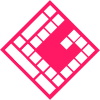

# [Gather](https://gather.wtf)




## Development

Gather is built using Substrate (Rust), for the UI we are using React and Material-UI.

### Clone the repo

```
git clone https://github.com/gnunicorn/gather
cd gather
```

### Backend / Blockchain / Substrate

To install the Substrate Development environment follow the [official guide for a full install](https://substrate.dev/docs/en/getting-started/installing-substrate#fast-installation). On Linux and Mac this boils down to running:

```sh
curl https://getsubstrate.io -sSf | bash -s -- --fast
```

Then you can compile and run the local development client with:

```sh
cargo run -- --dev
```

### Frontend / React

You need [Node.js](https://nodejs.org/en/) and the [yarn package manager](https://yarnpkg.com/lang/en/).

The frontend lives in `/app`. To run the dev server for the UI, just cd into that directory and run:

```sh
yarn start
```

This will open the browser showing the JS app locally, connecting to the local blockchain node via an unsecure websocket. It automatically reloads the UI on changes in `/app/src`. 


To start the UI connecting to a  remote server, put the address in the enviornment variable `$REACT_APP_WS_TARGET` when starting the server, e.g.:

```sh
REACT_APP_WS_TARGET="ws://otherhost.tld:9944" yarn start
```
